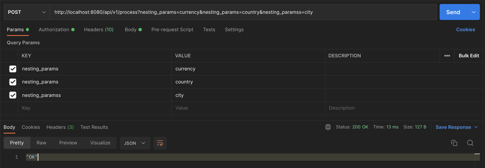

# flaconi-challenge

There are 2 go applications in this git repository. The go app found in `/app/app.go` contains the solution for programming task 1 and the app in `/main.go` contains the solution for programming task 2.

### Pre-requisites
- Go
- Docker
- Postman

### Running the Apps

To test/run the different applications follow the instructions below:

- Clone this repository
- Navigate into the root directory of the cloned application.
- Create a `.env` file in the root of the cloned repository.
- Copy the contents of `.env.sample` into the `.env` file 

#### Running the command line app
- Run the docker image for the app:
```
$ docker-compose up --build flaconi-cmd-app
```

After running this command, this will create an `output.json` file in the root directory of the cloned repository.

#### Running the REST API
- Run the docker image for the REST API:
```
$ docker-compose up --build flaconi-rest-app
```

After starting the docker container, the echo server will start on port `:8080`
- Open your postman application
- Create a POST request to `http://localhost:8080/api/v1/process` using the following params:
```
# QUERY PARAMS
nesting_params: currency
nesting_params: country
nesting_params: city

# REQUEST BODY
[
  {
    "country": "US",
    "city": "Boston",
    "currency": "USD",
    "amount": 100
  },
  {
    "country": "FR",
    "city": "Paris",
    "currency": "EUR",
    "amount": 20
  },
  {
    "country": "FR",
    "city": "Lyon",
    "currency": "EUR",
    "amount": 11.4
  },
  {
    "country": "ES",
    "city": "Madrid",
    "currency": "EUR",
    "amount": 8.9
  },
  {
    "country": "UK",
    "city": "London",
    "currency": "GBP",
    "amount": 12.2
  },
  {
    "country": "UK",
    "city": "London",
    "currency": "FBP",
    "amount": 10.9
  }
]

# AUTHORIZATION - BASIC AUTH
Username: flaconi
Password: secret
```

###### SAMPLE SCREENSHOT


